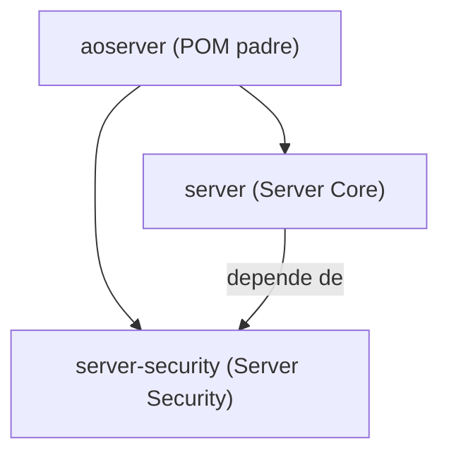
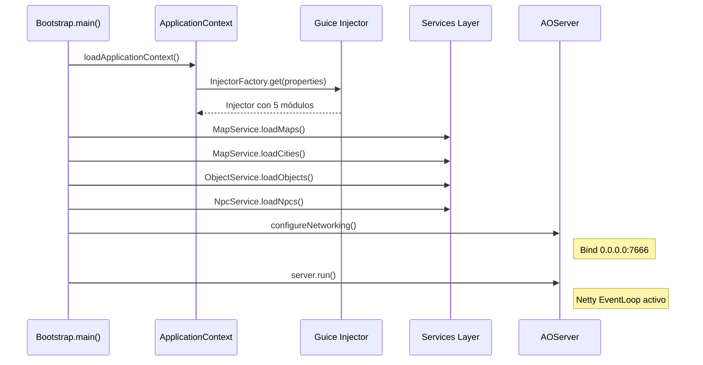
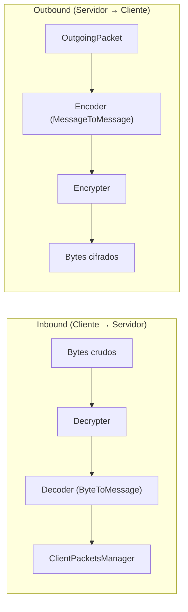
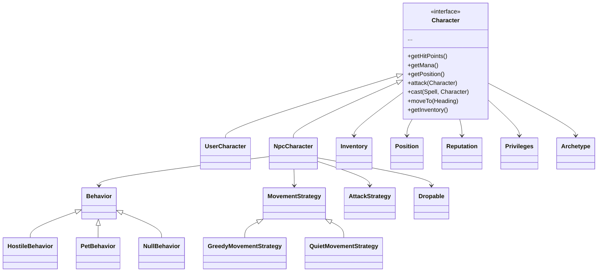
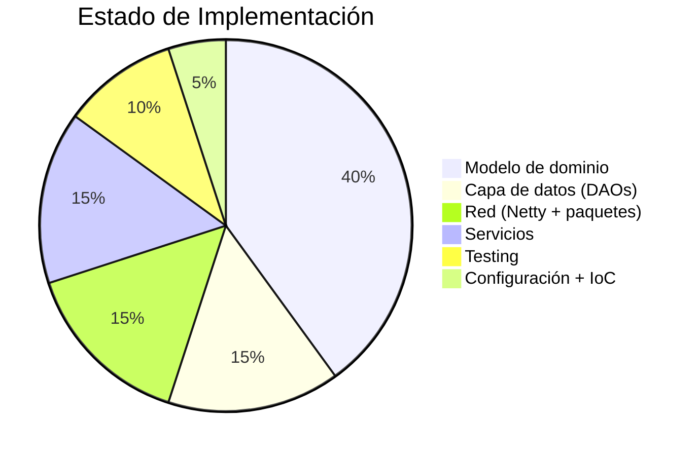

# 📖 Documentación Técnica — AO-Server

> **Análisis completo del servidor de Argentum Online en Java**
> Fecha: 2026-05-05 · Generada automáticamente por análisis de código fuente

---

## 📌 Resumen General

**AO-Server** es una reimplementación del servidor del MMORPG *Argentum Online* (originalmente en Visual Basic 6), escrita en **Java 17** con un enfoque moderno basado en:

- **Netty** para networking asíncrono de alto rendimiento
- **Google Guice** para inyección de dependencias (IoC)
- **Maven** como build system multi-módulo
- **JUnit 5 + AssertJ + Mockito** para testing
- **SLF4J + Logback** para logging

El proyecto está basado en [AOXP-Server](https://github.com/aoxp/AOXP-Server) (commit `daa8d10`) ya que la implementación original dejó de mantenerse.

---

## 🏗️ Arquitectura de Módulos



| Módulo | Artifact | Descripción |
|--------|----------|-------------|
| `aoserver` | `com.ao:aoserver:1.0-SNAPSHOT` | POM padre con gestión de dependencias y plugins |
| `server` | `com.ao:server` | Módulo principal: lógica de juego, red, datos, servicios |
| `server-security` | `com.ao:server-security` | Módulo de seguridad: cifrado/descifrado de tráfico de red |

---

## 📦 Stack Tecnológico

| Categoría | Tecnología | Versión |
|-----------|-----------|---------|
| **Lenguaje** | Java | 17 |
| **Build** | Maven | - |
| **Networking** | Netty (NIO) | 4.1.119.Final |
| **IoC/DI** | Google Guice | 7.0.0 |
| **Utilidades** | Google Guava | 32.0.1-jre |
| **Logging** | SLF4J + Logback | 2.0.17 / 1.5.18 |
| **Configuración** | Apache Commons Configuration2 | 2.12.0 |
| **Validación** | Hibernate Validator + Expressly | 9.0.0 / 6.0.0 |
| **Testing** | JUnit 5 + AssertJ + Mockito | 5.13.4 / 3.27.3 / 5.18.0 |
| **Cobertura** | JaCoCo + Coveralls | 0.8.13 |
| **CI/CD** | GitHub Actions | - |

---

## 📂 Estructura de Paquetes (Módulo `server`)

```
com.ao
├── Bootstrap.java              ← Punto de entrada (main)
├── AOServer.java               ← Servidor Netty (Runnable)
│
├── action/                     ← Sistema de acciones asíncronas
│   ├── Action.java
│   └── ActionExecutor.java     ← Executor de single-thread con cola
│
├── config/                     ← Configuración del servidor
│   ├── ArchetypeConfiguration.java
│   ├── ServerConfig.java       ← Interfaz de configuración
│   └── ini/
│       ├── ArchetypeConfigurationIni.java
│       └── ServerConfigIni.java ← Implementación basada en INI
│
├── context/                    ← Contexto de aplicación (Service Locator)
│   ├── ApplicationContext.java
│   └── ApplicationProperties.java
│
├── data/dao/                   ← Capa de Acceso a Datos
│   ├── AccountDAO.java
│   ├── CityDAO.java
│   ├── MapDAO.java
│   ├── NpcCharacterDAO.java
│   ├── ObjectDAO.java
│   ├── UserCharacterDAO.java
│   ├── exception/
│   │   ├── DAOException.java
│   │   └── NameAlreadyTakenException.java
│   ├── ini/                    ← Implementaciones basadas en INI
│   │   ├── CityDAOIni.java
│   │   ├── LegacyObjectType.java
│   │   ├── NpcDAOIni.java
│   │   ├── ObjectDAOIni.java
│   │   └── UserDAOIni.java
│   └── map/
│       └── MapDAOImpl.java     ← Lectura de mapas binarios
│
├── ioc/                        ← Módulos Guice (DI)
│   ├── ArchetypeLocator.java
│   ├── InjectorFactory.java    ← Fábrica central del Injector
│   └── module/
│       ├── ArchetypeModule.java
│       ├── BootstrapModule.java
│       ├── ConfigurationModule.java
│       ├── DaoModule.java
│       ├── SecurityModule.java
│       └── ServiceModule.java
│
├── model/                      ← Modelo de dominio
│   ├── character/              ← Personajes (jugadores y NPCs)
│   │   ├── Character.java      ← Interfaz base
│   │   ├── UserCharacter.java  ← Personaje de jugador
│   │   ├── NpcCharacter.java   ← Personaje NPC
│   │   ├── Race.java, Gender.java, Skill.java, Attribute.java...
│   │   ├── archetype/          ← 14 arquetipos (Mage, Warrior, etc.)
│   │   ├── attack/             ← Estrategias de ataque
│   │   ├── behavior/           ← Comportamientos NPC (Hostile, Pet, Null)
│   │   ├── movement/           ← Estrategias de movimiento (Greedy, Quiet)
│   │   └── npc/
│   │       ├── Drop.java
│   │       ├── drop/           ← Estrategias de drop (Random, DropAll)
│   │       └── properties/     ← Tipos de NPC (Creature, Guard, Merchant...)
│   │
│   ├── inventory/              ← Sistema de inventario
│   │   ├── Inventory.java
│   │   └── InventoryImpl.java
│   │
│   ├── map/                    ← Sistema de mapas
│   │   ├── Map.java            ← 100x100 tiles, búsqueda de caminos
│   │   ├── Tile.java           ← Celda del mapa
│   │   ├── Position.java       ← Coordenadas (mapa, x, y)
│   │   ├── City.java           ← Ciudades
│   │   ├── Heading.java        ← Direcciones (N/S/E/W)
│   │   ├── Trigger.java        ← Triggers de tiles
│   │   └── area/AreaInfo.java  ← Info de área visible
│   │
│   ├── object/                 ← ~30 tipos de objetos del juego
│   │   ├── Object.java         ← Interfaz base
│   │   ├── Item.java, Weapon.java, Armor.java, Shield.java...
│   │   ├── Food.java, Drink.java, HPPotion.java, ManaPotion.java...
│   │   ├── Boat.java, Door.java, Key.java, Sign.java...
│   │   └── properties/         ← Propiedades de objetos + crafting
│   │
│   ├── spell/                  ← Sistema de hechizos
│   │   ├── Spell.java
│   │   └── effect/             ← 8 efectos (HitPoints, Poison, Paralysis...)
│   │
│   └── user/                   ← Usuarios y cuentas
│       ├── User.java           ← Interfaz base
│       ├── ConnectedUser.java  ← Usuario conectado (pre-login)
│       ├── LoggedUser.java     ← Usuario autenticado (post-login)
│       ├── Account.java / AccountImpl.java
│       └── Guild.java
│
├── network/                    ← Capa de red
│   ├── Connection.java         ← DTO usuario+canal
│   ├── DataBuffer.java         ← Wrapper sobre ByteBuf de Netty
│   ├── ClientPacketsManager.java ← Dispatcher de paquetes entrantes
│   ├── ServerPacketsManager.java ← Dispatcher de paquetes salientes
│   └── packet/
│       ├── IncomingPacket.java  ← Interfaz para paquetes cliente→servidor
│       ├── OutgoingPacket.java  ← Interfaz para paquetes servidor→cliente
│       ├── incoming/           ← 7 paquetes entrantes implementados
│       │   ├── LoginExistingCharacterPacket
│       │   ├── LoginNewCharacterPacket
│       │   ├── TalkPacket, YellPacket, WhisperPacket
│       │   ├── WalkPacket
│       │   └── ThrowDicesPacket
│       └── outgoing/           ← 22 paquetes salientes implementados
│           ├── AreaChangedPacket, BlockPositionPacket
│           ├── ChangeInventorySlotPacket, ChangeMapPacket
│           ├── CharacterCreatePacket, ConsoleMessagePacket
│           ├── DiceRollPacket, ErrorMessagePacket
│           ├── UpdateUserStatsPacket, ...
│
├── service/                    ← Capa de servicios
│   ├── AreaService.java → AreaServiceImpl
│   ├── CharacterBodyService.java → CharacterBodyServiceImpl
│   ├── LoginService.java → LoginServiceImpl
│   ├── MapService.java → MapServiceImpl
│   ├── NpcService.java → NpcServiceImpl
│   ├── ObjectService.java → ObjectServiceImpl
│   ├── TimedEventsService.java → TimedEventsServiceImpl
│   ├── UserService.java → UserServiceImpl
│   ├── PrivilegesService.java
│   ├── ValidatorService.java
│   └── CharacterIndexManager.java
│
└── utils/                      ← Utilidades
    ├── IniUtils.java           ← Lectura de archivos INI legacy
    └── RangeParser.java        ← Parser de rangos numéricos (ej: "1-40")
```

### Módulo `server-security` (3 archivos)

```
com.ao.security
├── Hashing.java                ← Utilidad de hashing MD5
├── SecurityManager.java        ← Interfaz de seguridad (encrypt/decrypt)
└── impl/
    └── DefaultSecurityManager.java ← Implementación sin cifrado (desarrollo)
```

---

## 🔄 Flujo de Ejecución



---

## 🌐 Pipeline de Red (Netty)

El servidor usa **Netty** con el patrón **Reactor** (boss/worker event loop groups):



### Paquetes Entrantes Implementados (7)

| ID | Paquete | Descripción |
|----|---------|-------------|
| 0 | `LoginExistingCharacterPacket` | Login con personaje existente |
| 1 | `ThrowDicesPacket` | Tirar dados para atributos |
| 2 | `LoginNewCharacterPacket` | Crear nuevo personaje |
| 3 | `TalkPacket` | Mensaje de chat |
| 4 | `YellPacket` | Gritar (chat amplio) |
| 5 | `WhisperPacket` | Susurro (chat privado) |
| 6 | `WalkPacket` | Movimiento del personaje |

### Paquetes Salientes Implementados (22)

Entre los más relevantes: `CharacterCreate`, `ChangeMap`, `UpdateUserStats`, `ConsoleMessage`, `ErrorMessage`, `DiceRoll`, `PlayMidi`, `PlayWave`, `ChangeInventorySlot`, `ChangeSpellSlot`, etc.

---

## 🎮 Modelo de Dominio

### Character (Interfaz central)

El modelo de personajes usa una arquitectura basada en interfaces y patrones Strategy:



### Arquetipos (14 clases)

Warrior, Mage, Paladin, Cleric, Assasin, Bard, Druid, Bandit, Thief, Pirate, Hunter, Fisher, Lumberjack, Miner, Blacksmith, Carpenter, Worker.

### Razas y Géneros

Definidos como enums: `Race` (Human, Elf, DarkElf, Dwarf, Gnome) y `Gender` (Male, Female).

### Tipos de NPC

Creature, Guard, Merchant, Trainer, Governor, Noble (cada uno en `npc.properties`).

---

## 🗺️ Sistema de Mapas

- **Grilla**: 100×100 tiles por mapa
- **Área visible**: 8×6 tiles (VISIBLE_AREA_WIDTH × VISIBLE_AREA_HEIGHT)
- **Distancia máxima**: 12 tiles
- **Total de mapas configurados**: 290 (archivos `.map`, `.inf`, `.dat`)
- **Archivos de mapa en resources**: 870 archivos
- **Formato**: Binario (legacy del AO original en VB6)
- **Tipos de tile**: Ground, Water, Lava, con triggers y salidas

---

## 💉 Sistema de Inyección de Dependencias

El IoC usa **Google Guice** con 5 módulos:

| Módulo | Bindings principales |
|--------|---------------------|
| `BootstrapModule` | `ServerConfig` → `ServerConfigIni` |
| `ConfigurationModule` | `ArchetypeConfiguration` → INI |
| `DaoModule` | `MapDAO`, `AccountDAO`, `ObjectDAO`, `CityDAO`, `NpcCharacterDAO` → Impl INI |
| `ServiceModule` | `LoginService`, `MapService`, `ObjectService`, `UserService`, `NpcService`, etc. → Impls |
| `SecurityModule` | `SecurityManager` → cargado dinámicamente por reflection |

> [!WARNING]
> El `ApplicationContext` usa un **patrón Service Locator estático** que los propios desarrolladores marcan como TODO para eliminar. Esto dificulta la testabilidad y acopla el código.

---

## 📁 Persistencia de Datos

La capa de datos lee formatos **legacy INI** del AO original:

| DAO | Archivo fuente | Datos |
|-----|---------------|-------|
| `ObjectDAOIni` | `data/objects.dat` | ~600+ objetos del juego |
| `NpcDAOIni` | `data/npcs.dat` | NPCs del mundo |
| `CityDAOIni` | `data/cities.dat` | Ciudades y spawn points |
| `UserDAOIni` | `charfiles/` | Archivos de personaje |
| `MapDAOImpl` | `maps/MapaN.{map,inf,dat}` | Mapas binarios |

> [!NOTE]
> No hay base de datos relacional. Todo se persiste en archivos INI y binarios, manteniendo compatibilidad con el formato original de Argentum Online.

---

## ⚙️ Configuración

### `project.properties` — Configuración del contexto de aplicación
Rutas a archivos de datos, configuración de razas (heads y bodies), inventario, seguridad.

### `server.ini` — Configuración del servidor en formato INI
- **Puerto**: 7666 (por defecto)
- **Versión del cliente**: 0.13.0
- **Max usuarios**: 550
- **Creación de personajes**: Activada
- **Staff**: Listas de Dioses, Semidioses, Consejeros, RolesMasters
- **Intervalos de juego**: Regeneración, hambre, sed, veneno, movimiento, ataque, etc.
- **MD5 Hashes**: Verificación de integridad del cliente

---

## 🧪 Testing

| Métrica | Valor |
|---------|-------|
| **Archivos de test** | 64 |
| **Archivos de producción** | 254 (+3 security) |
| **Ratio test/src** | ~25% |

### Cobertura por capa:

| Capa | Tests | Observación |
|------|-------|-------------|
| **Model (objects)** | ✅ 35 tests | Excelente cobertura de ~30 tipos de objeto |
| **Model (spell effects)** | ✅ 7 tests | Buena cobertura |
| **Model (character)** | ⚠️ 4 tests | Solo Reputation, Archetype, Movement |
| **Model (map)** | ✅ 2 tests | Map y Position |
| **Data (DAO)** | ✅ 5 tests | CityDAO, NpcDAO, ObjectDAO, UserDAO, MapDAO |
| **Network** | ⚠️ 2 tests | Solo LoginPackets |
| **Service** | ⚠️ 4 tests | CharacterBody, MapService, TimedEvents |
| **Model (user)** | ✅ 1 test | AccountImpl |

### CI/CD

GitHub Actions ejecuta en cada push/PR a `main`:
1. Checkout + Setup Java 17 (Temurin)
2. `mvn -B package`
3. `mvn clean test jacoco:report`
4. Envío de cobertura a Coveralls
5. Dependency submission para Dependabot

---

## 📊 Estado de Madurez del Servidor



### ✅ Lo que FUNCIONA (o está muy avanzado)

- **Modelo de dominio completo**: Personajes, NPCs, objetos (~30 tipos), hechizos, mapas, inventario
- **Capa de datos**: Lectura de archivos INI y mapas binarios legacy
- **Infraestructura de red**: Pipeline Netty con cifrado/descifrado, decodificación/codificación
- **Inyección de dependencias**: 5 módulos Guice configurados
- **CI/CD**: Pipeline completo con tests y cobertura
- **Paquetes básicos**: Login (existente + nuevo), chat (talk/yell/whisper), movimiento

### ⚠️ Lo que está INCOMPLETO (TODOs del código)

1. **Game timers** (`Bootstrap.java:87`): `startTimers()` está vacío — no hay game loop
2. **Servicios pendientes** (`Bootstrap.java:114`): `TODO Load other services`
3. **Service Locator** (`ApplicationContext.java:9`): Eliminar Injector estático
4. **Combate**: Sin implementación de game loop de combate
5. **Paquetes entrantes**: Solo 7 de ~50+ del protocolo original
6. **Paquetes salientes**: 22 definidos pero no todos integrados
7. **Sistema de persistencia**: Sin guardado (solo lectura de datos)
8. **Cifrado real**: `DefaultSecurityManager` no cifra nada
9. **Chat de guild**: Paquete definido pero sin lógica
10. **Spawning de NPCs**: Servicio de NPC carga datos pero no spawnea

### 🔴 Lo que FALTA implementar

- Game loop principal (tick-based)
- Sistema de combate PvP y PvE
- Sistema de comercio (NPCs y entre jugadores)
- Sistema de crafting
- Sistema de guilds/clanes completo
- Sistema de misiones/quests
- Administración en runtime (comandos GM)
- Persistencia de personajes (escritura)
- Cifrado real del tráfico
- Muchos paquetes del protocolo AO

---

## 🔗 Referencias

- **Repositorio original**: [AOXP-Server](https://github.com/aoxp/AOXP-Server)
- **Commit base**: `daa8d10b83b762a0072dd022e99fdfab1c57bb6b`
- **Argentum Online**: MMORPG argentino desarrollado en 1999 por Pablo Márquez
